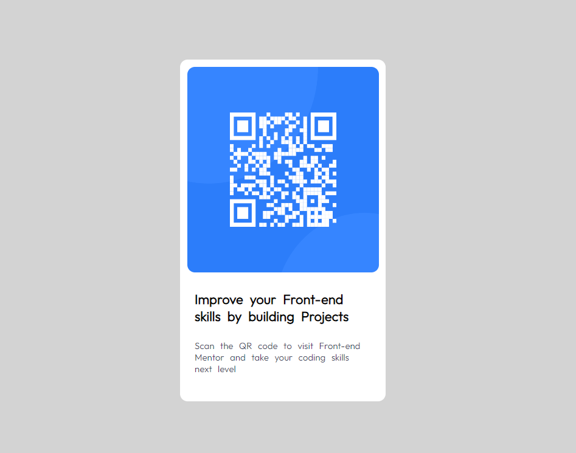

# Frontend Mentor - QR code component solution

## Table of contents

- [Overview](#overview)
  - [Screenshot](#screenshot)
  - [Links](#links)
- [My process](#my-process)
  - [Built with](#built-with)
  - [What I learned](#what-i-learned)
  - [Useful resources](#useful-resources)
- [Author](#author)
- [Acknowledgments](#acknowledgments)

## Overview
This is a QR code component challenge on Frontend Mentor. In this project I have tried to give solution of that project.  I am doing this challenge to improve my coding skills. In this project I have only used html and css.

### Screenshot

### Links

- Solution URL:(https://github.com/Nitrajstp/frontendproject1/blob/main/qr-code-component-main/index.html)
- Live Site URL:(https://qrweb.s3.amazonaws.com/index.html)

## My process
First I have created document section which contain html tag.
<Html> has two childeren <head> and <body>.
Head section have <link> tag which connects fonts style.
HTML Structure
<!DOCTYPE html>
<html lang="en">
<head>
  <!-- Meta tags and link to the favicon -->
  <!-- Title of the page -->
  <!-- Link to Google Fonts -->

  
</head>
<body>
  

    

      <!-- Image element for the QR code -->
      <!-- Heading and paragraph for project description -->
    

  

</body>
</html>
CSS Styles-
-The CSS styles are contained within a <style> tag in the document's <head>. Here are the key styles used:
<Body>
 Styles:

-Background color is set to light grey.
-The body element is displayed as a flex container, vertically and horizontally centered.
-A box shadow is applied to the body for a subtle elevation effect.
-The font used is "Outfit" from Google Fonts, with a fallback to sans-serif.

Container Styles:
  -Maximum width is set to 360 pixels.
  -Centered horizontally using margin: 0 auto

Box Styles:

 - White background color.
 - Flex container with content centered both horizontally and vertically.
 - Fixed width of 270 pixels and height of 450 pixels.
 - Rounded corners (border radius) of 10 pixels.
 - Margins added to the left and right of the box.

Image Styles:
 - Margin applied to the top, left, and right of the image.
 - Rounded corners (border radius) of 10 pixels.
 - Fixed dimensions: height of 270 pixels and width of 252 pixels.
 - Heading and Paragraph Styles:

Margins and padding applied for spacing.
Font size, color, and line spacing defined for text elements.

### Built with

- Semantic HTML5 markup
- CSS custom properties
- Flexbox

### What I learned

By doing this project i have learnt- 
HTML and CSS Integration
CSS Flexbox Layout
Google Fonts Integration
Image Handling
Styling Techniques
Margin and Padding Usage

### Useful resources

- [Example resource 1](https://chat.openai.com) - This helped me for  recalling various  css properties and helps me write clean code . I really liked this platform and I will use it for my further projects.

## Author
-Github account- [ @Nitrajstp]( https://github.com/Nitrajstp)
- Frontend Mentor - [@Nitrajstp](https://www.frontendmentor.io/profile/Nitrajstp)
- Twitter - [@nitraj_bharti](https://twitter.com/nitraj_bharti)

## Acknowledgments
I would like to express my sincere thanks to chatgpt which helps me many times in this journey.

